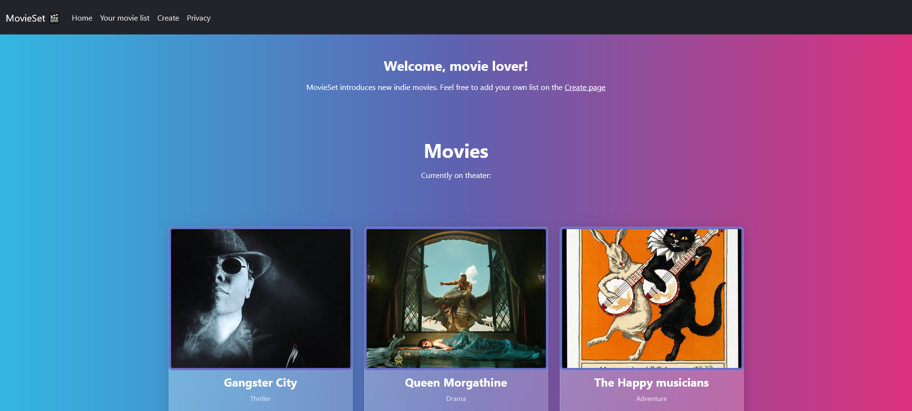

# $\textsf{\color{#c604c9}{Movie Page}}$ 🎬

#### Framework: ASP.NET

This project was about:
- getting to know ASP.NET
- use MVC model
- use form that takes data and adds the data to other page
- how to use <a href="https://bootswatch.com/" target="_blank">Bootswatch</a> templates

Resources are from Pixabay, see the resourcesLinks.txt

